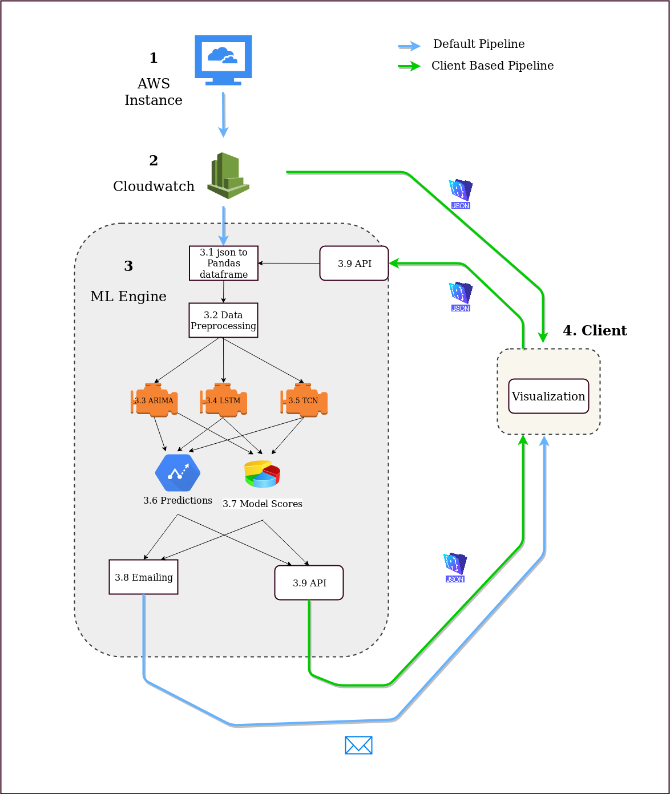
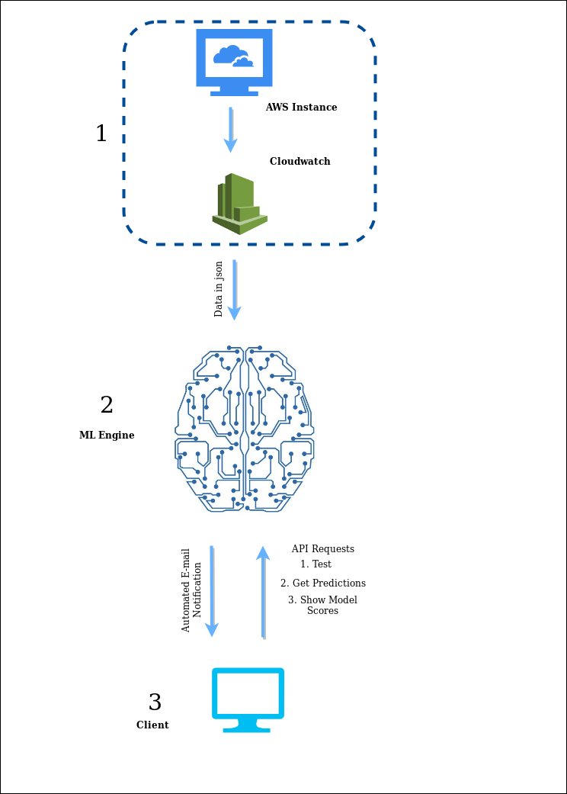

# Architecture
The intention of this project is the early notification about system overloading (exceeding the maximum allocated CPU utilization) of cloud instances. The cloud vendor which was targeted here is AWS for now. 

The complete architecture of the system is shown in the below diagram.




As shown in the diagram, the ML engine gets data from AWS Cloudwatch and trains itself. The predictions are then sent to the client. Also the client can train a model, get predictions and model scores by API requests.

## 1. AWS Instance

The AWS instances should be monitored and auto-sacled accordingly to ensure that the allocated resource are fully optimized and not exceeded. This is done by monitoring their performance metrics. 

## 2. Cloudwatch

AWS lets the customers to observe performance metrics of their instances using Cloudwatch. For the prediction system, below metrics are required.
1. CPU utilization
2. Memory utilization
3. Network Input
4. Network Output

Cloudwatch supports 1,3 and 4 of these metrics to be acquired by default using get-metric-data API request. For the memory utlization data, we need to push that metric from AWS instance to Cloudwatch using push-metric-data API.

Note: The metric values are recorded in Cloudwatch with 5 minute intervals by default. If ‘Detailed Monitoring’ is enabled for the instance, metric data can be recorded with 1 minute intervals. For this system, ‘Detailed Monitoring’ is not required.

A json response containing metric data is received for the get-metric-data API request. 

## 3. Machine Learning Engine

The diagram shows the main components, processes and the flow of the ML engine. 

* A crontab command runs with below executions at regular intervals. 
    * Call get-metric-data API and get the json response
    * json response is converted to a Pandas dataframe
    * Updates a CSV with the dataframe

* Three ML models are built at the initialization. 
    * LSTM model
        * Hyper-parameters
    * TCN model
        * Hyper-parameters
    * ARIMA model
        * Hyper-parameters


* The data in CSV is read and preprocessed to get the numpy arrays which are the inputs to the ML models.
    * Pre-processing Steps
        * Data Cleaning
            * Filling non-values
        * Features Generated
            * Feature list

        * Scaling and reshaping

* The three models are trained at the same regular interval with the new data.

* Predictions for the next fixed period and the model scores with new training are stored to the disk.
    * Model Scores
        * MAPE Accuracy
        * Callback

* The predictions with best model scores will be emailed to the client as a plot. Mailing interval can be configured.

* A flask app runs to expose APIs for client side requests.

## 4. Client Side

Client receives emails with the regular intervals as mentioned above. 
Also the client can use APIs for below tasks.
* Get the most recent predictions
    * A json response is received which can be  visualised with a python code.
* Get the predictions for a dataset.
    * The data-set should be acquired from Cloudwatch. The json response from cloudwatch can be forwarded to the ML engine to get predictions.
* Get the model scores
    * A json response is received which can be visualised by a python code. 
* Test one of three models with a data-set and get the scores. 
    * A json response is received


# Deployment
Deployment should be done in 3 platforms.
* AWS Instance and Cloudwatch Configuration
* ML Engine Deployment
* Client Side Deployment
#



The deployment should be done for each part as follows. 

Note: Unless specified, each command execution should be successfully finished before executing the next command. 

## 1. AWS Instance and  Cloudwatch Configuration

The already available metrics are visible in Cloudwatch under metrics category. By default, it does not provide memory utilization metric. Therefore, we have to push memory utilization data from EC2 instance to cloudwatch. Steps are given below.

***Note: Your IAM role must be permitted to use the push-metric-data and get-metric-data APIs for this task.***

* Log into the EC2 instance.
* Install the dependencies by executing below commands.
```
sudo apt-get update
sudo apt-get install unzip libwww-perl libdatetime-perl
```
* Download and extract the Cloudwatch monitoring script as follows.
```
cd /opt
wget http://aws-cloudwatch.s3.amazonaws.com/downloads/CloudWatchMonitoringScripts-1.2.1.zip
unzip CloudWatchMonitoringScripts-1.2.1.zip
```

* Get into the extracted directory and configure the credentials.
```
cd /opt/aws/aws-scripts-mon
sudo nano awscreds.template
```
* Now type the credentials and save the file. Then copy this file to config file as follows.

```
sudo cp awscreds.template awscreds.conf
```
* Now the setup is complete. Check the status by executing below command.
```
./mon-put-instance-data.pl --mem-util
```
* You should get a response as follows in case of successful setup of the script.
```
Successfully reported metrics to CloudWatch. Reference Id: b1a3050a-a45f-11e9-a745-9fd53b3ca01d
```
* Now to automate this reporting of data, the crontab should be edited as follows.
```
sudo nano crontab
```
* Enter the below line in the bottom of the crontab, exit with saving. 
```
*/5 * * * * /opt/aws-scripts-mon/mon-put-instance-data.pl --mem-used-incl-cache-buff --mem-util --disk-space-util --disk-path=/ --from-cron
```
To ensure that you have successfully pushed the custom metrics into Cloudwatch, log into the Cloudwatch console and check whether the custom metrics are shown in Metrics > All Metrics > Linux System.

## 2. Deploying ML  Engine
The deployment can be done in the same instance which is monitored or in another dedicated instance. If the deployment is done in the same instance, configuring AWS is not required as it is already configured. If dedicated instance is used, configuration should be done as follows.
Follow [this](https://docs.aws.amazon.com/cli/latest/userguide/install-linux.html) to install the AWS CLI on linux.
After the installation, configure the AWS CLI by executing below command and providing credentials. Enter ‘json’ as the output format. 

```
aws configure
```
After the configuration is done, a virtual environment should be created with required dependencies.
 
Input below commands in terminal. 

* Install Python3
```
sudo apt-get install python3
```
* Install pip3
```
python3 -m pip install --user --upgrade pip
```
* Install virtualenv
```
python3 -m pip install --user virtualenv
```
* Create a new virtual environment.
```
python3 -m venv env
```
* Activate the virtual environment.
```
source env/bin/activate
```

* Install the dependencies.
```
pip3 install tensorflow
pip3 install keras
pip3 install requests
pip3 install keras-tcn
pip3 install flask
```
* Clone this repository, cd into the cloned directory and execute below command.
```
cd Engine
python engine.py
```
Server side deployment is done.
If you want to activate the emailing function, enter the required credentials in the `mailing.py` file.


## 3. Client Side Deployment


Below API requests can be used as a client. Clone this Github repository to proceed.

* Get the scores of the trained models. The response is a json containing model scores.
Send a GET request to ```<server ip>:<port>/compare```
Default port is 80 unless changed in engine.py .
The score plots can be seen by running ```show_metric_api.py``` from client side.


For below API requests to be sent the client should get data as a json file from Cloudwatch. For that, configure the AWS CLI as described  here. 
Enter the needed credentials in ```queries.json``` and save it.

To get the dataset from Cloudwatch, send below API request.
The start time and end time can be varied accordingly.

```
aws cloudwatch get-metric-data --start-time 2019-07-08T00:00:00 --end-time 2019-07-11T23:00:00 --metric-data-queries file://./queries.json >> <name>.json
```
* Evaluate a model using a dataset.
Get the ```validate_api.py``` from this repository and modify with entering the json file name and server ip address, then run. This will show the model scores for the particular dataset.

* Get predictions.
Get the ```predict_api.py``` from this repository and modify with entering the json file name and server ip address, then run.
Or send a curl request as ``` curl -X GET <server ip>:<port>/predictions```